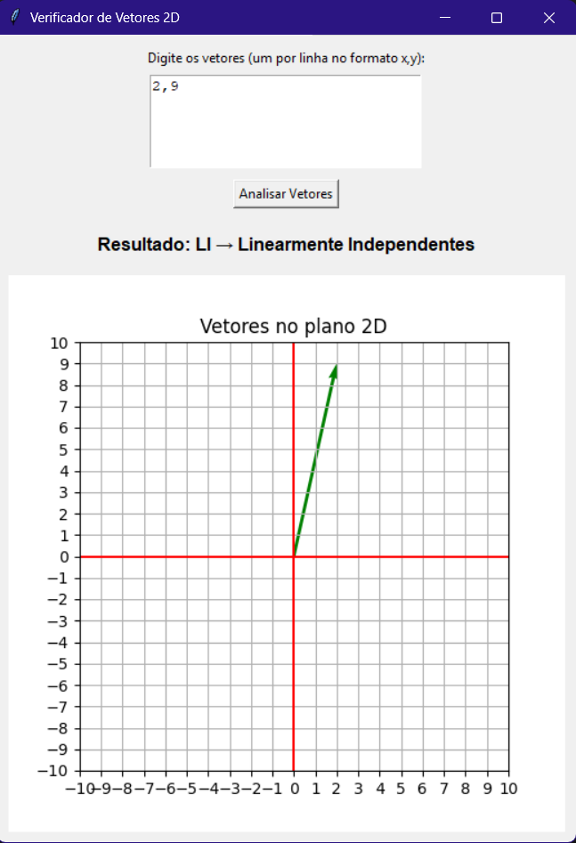

# Verificador de Dependência Linear de Vetores 2D

Este projeto é uma aplicação em Python com interface gráfica (GUI) que permite:

- Inserir vetores 2D manualmente.
- Verificar se os vetores são **linearmente dependentes** ou **independentes**.
- Visualizar os vetores graficamente em um plano cartesiano.

---

## 📷 Interface



---

## 🚀 Tecnologias Utilizadas

- [Python 3](https://www.python.org/)
- [Tkinter](https://docs.python.org/3/library/tkinter.html) – Interface gráfica
- [NumPy](https://numpy.org/) – Cálculo de posto da matriz
- [Matplotlib](https://matplotlib.org/) – Gráfico dos vetores

---

## 📦 Instalação

1. **Clone o repositório:**

```bash
git clone https://github.com/seu-usuario/verificador-vetores.git
cd verificador-vetores
```
2. **Instale as dependências:**
```bash
pip install matplotlib numpy
```

---

## ▶️Como Executar
```bash
python verificador_li_ld_r2.py
```
---

## 🧠 Como Usar
1. Digite os vetores no campo de entrada, um por linha, no formato:
```bash
1,2
2,1
```
2. Clique em "Analisar Vetores".

3. Veja o resultado da análise e o gráfico gerado.

---

### Desenvolvido por Noah Franco.
Contribuições, sugestões ou melhorias são bem-vindas!


